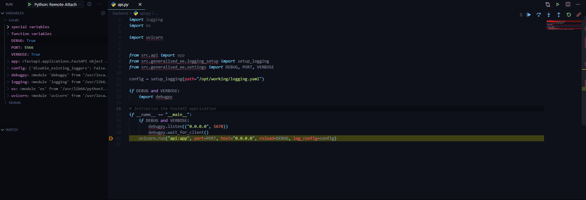

{{ course_summary(title, date, description=description, prev_know=prev_know, skills=skills, mentors=mentors, links=links) }}

## Errors and tracebacks

Python is like any coding language in that it's built upon a basic instruction set of what is and is not allowed to happen. Some basic rules include:

- You can add 2 string together

```python
"45" + "45"
# will return "4545"
```

- Integers can be added together

```python
45 + 45
# will return 90
```

- Strings and integers cannot be added together

```python
"45" + 45
# will return a TypeError: unsupported operand type(s) for +: 'int' and 'str'
```

In the final example, the TypeError that is returned isn't a commeont on the quality of your coding skills, itss just saying that what you're attempting to do isn't allowed by Python and it doesn't know what to do with it so it errors out to protect itself.

When a default error is raised within Python it's generally accompanied by a traceback, which is a set of directions to get to the origin of the issue. For the above TypeError, the full error message and traceback that is returned will look something like:

```bash
Traceback (most recent call last):
  File "<stdin>", line 1, in <module>
TypeError: unsupported operand type(s) for +: 'int' and 'str'
```

In the traceback component of the traceback, you'll see that it's directing you to the specfic line (line 1) in the file (<module>) that is causing the issue to occur. This allows a developer to quickly identify what piece of code is causing the issues and debug effectively.

## Handling errors

Error handling is for the scenarios when something goes wrong (incorrect formats, data, anything that the code isn't expecting) and we want to handle it gracefully rather than crashing the program completely with no warning and minimal explanation for an end user. To do this, we use python's inbuilt try/except code:

```python
try:
  do_something()
except:
  raise ValueError
```

What this communicates to Python is that we want it to **try** and run the function do_something(), and if an **except**ion is raised anywhere within the function, **raise** a ValueError. Because we're telling Python what to expect when it hits an error within our code, it won't crash and say that something unexpected has happened. However, just saying that a value error is raised doesn't really help communicate what the source of the problem is, because we should have taken that scenario into account right?

## Creating custom exceptions

Python allows you to create your own custom errors that can be as descriptive or unique as you want them to be. This has the advantage that you can communicate to end users or future developers using your code exactly what the source of the problem is. Lets start with defining a custom exception that inherits from the Exception base class:

```python
class PyCapError(Exception):
  pass
```

We'll also define a quick function that can be used for testing our brand new exception class.

```python
def split_birth_date(birth_date: str) -> dict:
  """
  Used to split out the individual date, month, year for a birth date
  Args:
    Birthdate (str): Birth date in the format dd/mm/yyyy

  Returns:
    date_info (dict): Dict containing date, month, year
  """
  day = birth_date.split(/)[0]
  month = birth_date.split(/)[1]
  year = birth_date.split(/)[2]

  return {"birth_day": day, "birth_month": month, "birth_year": year}
```

We can then use this error in our try and except statements:

```python
import PyCapError
import split_birth_date

birth_date = "01/01/2000"
birth_date_wrong = "1/2000"
birth_date_epoch = 55224464

try:
  split_birth_date(birth_date)
except:
  raise PyCapError("An incorrect date format was provided")
```

If we try and run the code using the *birth_date* variable, everything will run smoothly becuase it's in the format that it's expecting and the except clause won't be triggered. If we use either of other 2 variables though, the first one (*birth_date_wrong*) isn't the correct format, we'll try and get a value that doesn't exist and we'll have an exception raised. The variable *birth_date_epoch* will have a similar outcome as it's not a string and can't be split, raising our custom exception.
Handling exceptions this way let people know not just where the code is that is causing the error, but what the source of the error is.

So we can now handle all the errors that we'll ever have in our code and wrap everything in try/except statements. What happens when an exception gets raised that we can't find the source of?

## Debugging

Debugging is the process of analysing your code and removing bugs that might crop up. Fixing a bug can be as simple as changing a variable to a str vs a float that you were originally expecting or it might be as complex as rewriting an entire function because the incoming values are completely different/there is a major flaw in the library and approach you're taking.

Finding a bug can also vary in complexity. It could be as simple as realising you left a line of code in that was meant to be deleted, or as complex as the matrix you're generating isn't the right format for the external library you're using. There are a couple of ways we go about finding bugs (generally)

### Print statements

The most basic way to figure out where your code is breaking is to place print() statements throughout your code. These can be to figure out how far through a function we're getting to:

```python
print("We made it this far")
```

or it can be printing out variables to determine what they're being set as.

```python
print(birth_date)
# returns "1/2000"
```

This is a very manual way of approaching debugging and is good for either simple code or functions where the amount of variables that can go wrong are minimal. It's also quick and dirty if you already think you know exactly what's going on and can quickly verify your thoughts. Sometimes though, we need something more robust because we're trying to print out 400,000 line json files or we have a large amount of variables to check which is where a debugger comes in.

### Debuggers

Debuggers are programs that are generally run within an IDE and allow for more detailed and complex debugging. If setup correctly, they can be a quick and robust way to debug your code, but often can be a little bit time consuming to configure.

VSCode has an inbuilt debugger as well as debugger extensions that can downloaded and attached to a range of different code (python, node.js, javascript etc.) Microsoft has detailed documentation on how to setup a [debugger for VSCode](https://code.visualstudio.com/docs/python/debugging)

An example of an active debugger can be seen below:



We can see that the code has been stopped on a specific line with a red dot. This is known as a breakpoint and you can scatter those throughout your code to stop the code execution wherever you want. If you look in the left panel, the benefit of this approach vs using print statements is when you hit a breakpoint every variable's value is captured at that point in time. This gives you a solid view across all local and global variables that have been set and which can be incredibly helpful if you're not quite sure what the source of the problem is.

Another important aspect of debuggers is the ability to set the value of variable while the code is running. This allows you to make changes on the fly to test the code and check different formats, types etc. without yet having to design more robust dummy data that can replicate it.

Handling exceptions is an important part of writing any functional code and is crucial for when you want to start writing your own programs whether they're complex large pieces of software, or simple commandline programs like we'll cover in the next section.
