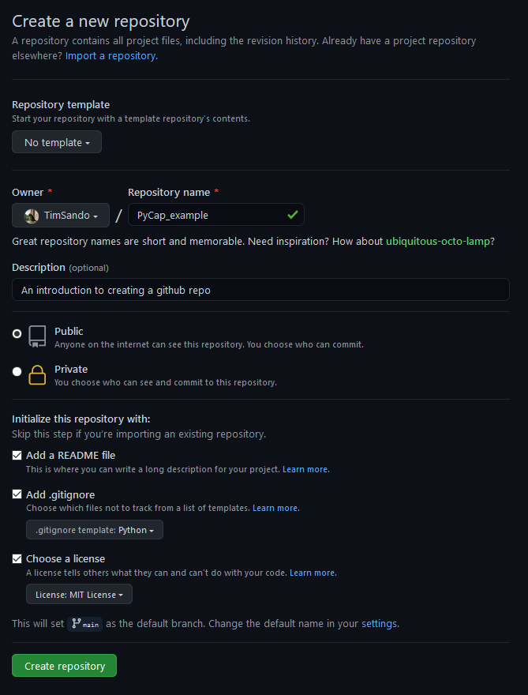
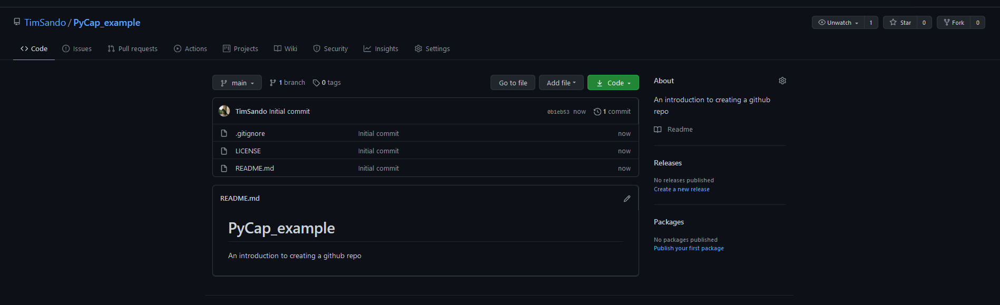
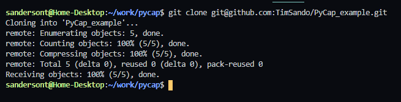

{{ course_summary(title, date, description=description, prev_know=prev_know, skills=skills, mentors=mentors, links=links) }}

## What is Open Source software?

Open Source software is code that is freely and publicly available for anyone to access and share. This gives full transparency for people to analyse what is going on under the hood, make improvements to the code if they have a great idea or use the code as part of their own projects. Due to the transparent nature of open source development, it promotes the sharing of ideas and collaboration over profit for an individual above all else.

The opposite of Open Source is closed source or proprietary which is software that has the source code tightly managed by a single group of developers or an organisation. This type of software often has much stricter terms of use for anyone wanting to leverage the functionality and the underlying code is seen as valuable 'trade secrets' that shouldn't be shared.

As you would imagine, open source can be a fantastic resource for people of all skills levels whether just learning to code in a certain discipline or for those with a wealth of experience working on the cutting edge and looking to collaborate/share ideas with their peers. However, how are you meant to share all the code so it's easily accessible to everyone? In comes platforms like Github to help solve this problem.

## Github

Built on top of the git source control framework, at its core Github is a place where anyone can upload their code for others to freely inspect and use and serves as the primary storage place for open source software.

From the Github website:

> GitHub is a code hosting platform for version control and collaboration. It lets you and others work together on projects from anywhere.

Github has been designed to serve everyone from a single person trying out coding for the first time and wanting to store their personal projects, to large organisations writing their own code and actively contributing to open source software development. *(Capgemini Invent has some software we've made Open Source, go check it out on our github!)*
Getting started with Github is easy and can be accomplished in a few quick steps and just requires a [github account](https://github.com/join?ref_cta=Sign+up&ref_loc=header+logged+out&ref_page=%2F&source=header-home) that we'd recommend signing up using your personal email address.

## Creating a new github repo

Once you've signed up, you can choose to create a new repo and fill out the required information. We've included an example repo setup below:



When you hit create, Github will instantly create a new repo for you to use and push your first code to, how exciting is that!



The next step is cloning down the repo so you can start writing some code to commit.

## Cloning a repo

As we covered in the last section with source control, when you take a clone of a repo you are just making a local copy that you can work on and change as much as you like without impacting the original source code. To do this you'll need to open up your terminal/commandline and navigate to the directory you want to clone the repo into.
*If you're using VSCode and have added it to your Path during installation on windows, you can simply right click inside a folder and choose "Open with Code" to open a new VSCode window + terminal in the folder of your choice.*


You can also use a tool like github desktop to handle the cloning of the repo but we won't cover that here.

Once you've navigated to the target directory, you just need to run the git clone command:

```bash
git clone https://github.com/TimSando/PyCap_example.git
# the github url to use here can be taken directly from your browser bar or from the Code dropdown on the github UI
```

This will clone down the entire repo for you to start coding!



## Pushing code to a github repo

In our source control chapter we covered the steps required to stage and commit your changes ready for pushing to a repo. Now that we have a repo available to push to, we can push any committed changes by simply calling:

```bash
git push
```

Pushing your committed changes will replicate what you have stored locally to the appropriate branch on the remote repo (assuming you have the correct permissions to push to that branch.) You can then open up Github and see your changes immediately reflected.

If you have been experimenting or playing around with different ideas and have written some code prior to making a repo, you can easily point your local repo to one on Github. This still requires you to initialise a new repo, stage your changes and commit these changes as we covered earlier but you need to follow a [couple of steps before pushing](https://docs.github.com/en/github/importing-your-projects-to-github/adding-an-existing-project-to-github-using-the-command-line).

```bash
git remote add origin https://github.com/TimSando/PyCap_example.git
# This connects your local repo to your remote Github repo for any pulls or push commands
```

You can then check you're connected to the right remote repo but using git remote

```bash
git remote -v
# This will return a list of all the remote connections.
```

Once you've confirmed you're connected you can then use git push like you have with an existing Github repo.

```bash
git push origin main
# pushes the changes from your current branch to the main branch of your remote repo
```

Now you've written your code and updated your repo and are on your way to creating your first program! Another way to contribute to the open source community is to enhance or fix other people's code which requires a slightly different approach.

## Forking a repo

Some repos have thousands of forks depending on the popularity and size of the community. If you want to contribute to another Github repo that you don't own, you need to either:

- Be provided special access permissions by the repo owner
- Make a fork of the repo and raise a pull request

Unless you have a close relationship with the owner of a repo or have actively been contributing to it's development, you're unlikely to get direct access to the repo so we're going to focus on forking a repo and contributing that way.

When you make a fork of a repo, it's similar to cloning in that you make a copy of that repo but instead of just having a local copy of the code that points to the original repo, you make a complete clone of the repo on Github which is then saved as your own repo. This gives you ownership over your fork and allows you to make whatever changes you want. To create a fork, you need to navigate to the repo on Github and select the Fork button on the right side of the page (see below)


When you click this, Github will prompt you to choose where it should make the fork (your personal account) and when you choose, a new repo will be created under your account, a direct clone of the original repo. You can tell whether a repo has been forked because Github will put a small comment under the repo name.


Once you've made a fork, you can follow all the normal steps around cloning it down, making changes and pushing them back up to your repo. However, when you push those changes it will only be stored on your fork of the original code. To get your changes back into the original code, you'll need to raise a Pull Request to the original repo owners.

## Raising a pull request

When you're writing code, there are a couple of main ways to have your code added to a repository/branch:

- Pushing (which we've already covered and requires you to have the correct permissions to push your code directly to a branch/repo)
- Pulling (we'll cover now)

Pulling is for when you don't have permission to directly push to a branch and is used by repo owners to quality control their code. When you raise a Pull Request you're asking the owner of a branch to "pull" in your changes and giving them a view over the changes you've made (the code difference) and a description of what/why you made the changes. If they decide your code meets the standards then they'll give it the green light and bring the code across.

If you're on a fork, you can raise a Pull Request by going to the pull request tab and hitting "New Pull Request", choose the branch/repo to push to, add comments to the pull request and then submitting.


If you're on a project, a pull request will be required to merge your feature/hotfix/bug code into the develop branch or move a release from develop to master for a major release.

If the pull request reviewer is happy they'll approve it, otherwise they can add comments on what you should improve before they'll allow it to come through. The process of giving feedback and making updates to a pull request is called a Code Reivew and it's a common practice especially on projects to ensure only high quality code is making it through to production.

## Code reviews

Code reviews are not only a great way to control the quality of the code, but they're also a perfect opportunity to learn from senior developers about best practices and how to approach problems. A senior developer can either put comments down for minor changes or work through a problem in person if the problem is more complex/a junior developer might need some additional help and support getting a task done. This way, the senior developer and instill good coding practices across the entire team and the final product benefits from this with fewer bugs and more readable code.